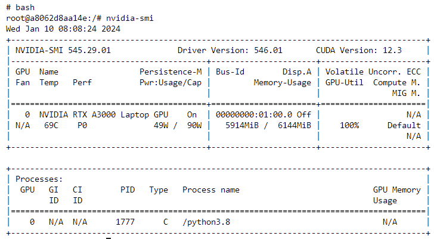

# Training LLAMA-2 QLORA on SMALL GPU
Trainer LLAMA-2 7B on small GPU with QLORA training on "mlabonne/guanaco-llama2-1k".

Test done on  
* NVIDIA A3000 GPU : 1 epoch on 90hours 52m
* NVIDIA A100 GPU : 30 epochs on 8hours 17m

## How To

Buil docker:

    docker compose build
	
Start docker:

    docker compose run
	
Open the jupyter and check it with nvidia-smi.

